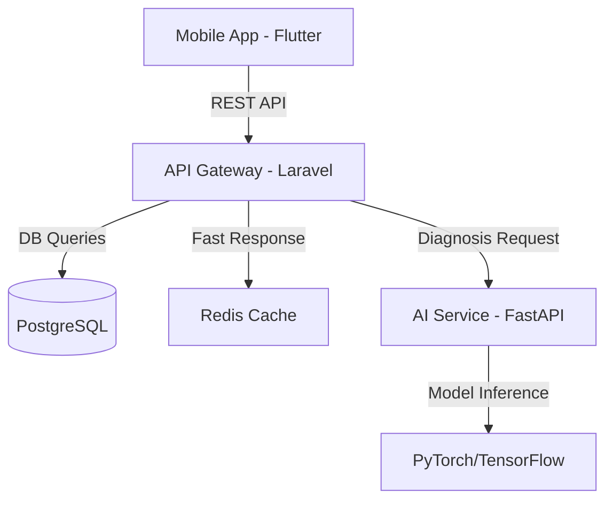

# 📂 ০৩. এসডিডি (System Design Document) - চাষীবন্ধু

এই ডকুমেন্টটি সিস্টেমের অভ্যন্তরীণ আর্কিটেকচার এবং লজিক্যাল ডিজাইন বর্ণনা করে। এটি ডেভেলপারদের জন্য মূল কারিগরি গাইডলাইন।

---

## ১. হাই-লেভেল আর্কিটেকচার (HLD)

সিস্টেমটি **Decoupled Monorepo** আর্কিটেকচার ফলো করবে।



## ২. ডাটাবেস ডিজাইন (ERD)

আমরা **PostgreSQL** ব্যবহার করছি যাতে লোকেশন বেজড কুয়েরি ফাস্ট হয়।

```mermaid
erDiagram
    USERS ||--o{ SCANS : "performs"
    USERS ||--o{ ORDERS : "places"
    DEALERS ||--o{ MARKET_ITEMS : "owns"
    
    USERS {
        bigint id PK
        string name
        string phone UNIQUE
        enum role "farmer, dealer, admin"
    }
    
    SCANS {
        bigint id PK
        bigint user_id FK
        string crop_name
        string ai_result
        timestamp created_at
    }
```

## ৩. এপিআই আর্কিটেকচার (API Contract)

*   **Version:** `v1`
*   **Response Format:** Standard JSON (`success`, `message`, `data`)
*   **Security:** Bearer Token (Laravel Sanctum)

---
**Status:** Approved Architecture
**Design Pattern:** Repository + Service Pattern
